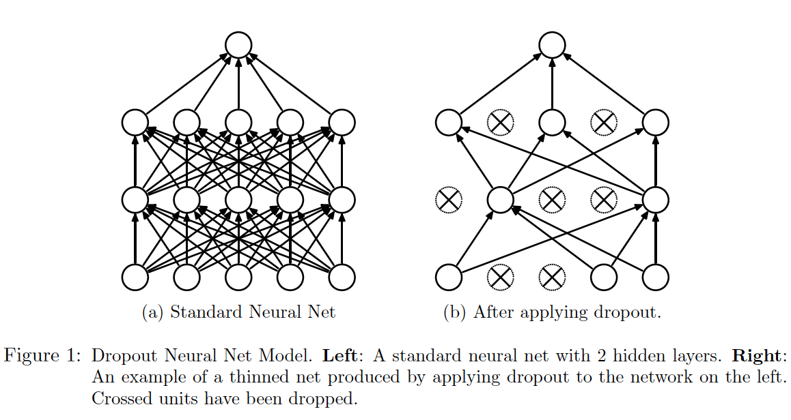

### 1. What is dropout?

Dropout is a **simple** and **powerful** regularization method used in modern neural networks. The key idea is to randomly drop units (along with their connections) from the neural network during training with a probability \(p\). Figure 1 illustrates how dropout is applied to a standard neural network (when training).

### 2. NOTE: TEST-TIME DROPOUT

The basic idea of this mechanism is very simple. But, do note that after a network with dropout is trained, i.e., when testing a network, 

- the same dropout mechanism should not be applied to the network any more, for we want a robust network instead of a reduced one.
- we can't simply drop the dropout mechanism as well, since that will cause a significant difference in the outputs of the training model and the model being tested.

A proper way is to use "a single unthinned network that has smaller weights", i.e., we multiply each of a layer's input (or equivalently, the outputs of the previous layer)  with the probability \(p\). Formally, for a network layer \(\mathbf{y} = f(W\mathbf{x}+\mathbf{b})\), let \(\mathbf{x}\in \mathbb{R}^d\), the output after dropout is applied is given by
$$
d(\mathbf{x}) = \begin{cases}
\mathbf{m}\odot \mathbf{x}, &\text{during training}\\
p\mathbf{x}, &\text{during testing}
\end{cases}
$$

$$
\mathbf{y} = f(Wd(\mathbf{x})+\mathbf{b})
$$
where \(\mathbf{m}\in\{0,1\}^d\) is a ***dropout mask*** that is generated using a **Bernoulli distribution** of probability \(p\). 

In modern deep learning tools like [pytorch](https://pytorch.org) in which dropout is already integrated, such changes can be easily achieved by some simple "switch", for example, in pytorch, the two different ways of applying dropout can be done by `model.train()` and `model.eval()`.

### 3. Dropout is great.

Dropout has proven to be a very effective regularization method, that is, it prevents neural networks, especially the "deep" ones, from overfitting. Moreover, it boosts the training process of a model. *Srivastava et al.* experimented this approach on many benchmark datasets and the results showed that the models applied with dropout not only trained faster but achieved less error rates than regular models. For more details, please refer to this paper: [*Srivastava et al.*, 2014](http://jmlr.org/papers/v15/srivastava14a.html).

###3. Why is dropout effective?

To be continued, soon.

### 4. When & How should dropout be used?

Despite it being powerful in regularizing a deep neural model, the dropout method has its limits. [Chiyuan Zhang et al., 2017](https://arxiv.org/abs/1611.03530) showed that dropout is not effective in CNN when the data are corrupted.

As far as I know, dropout is, generally, applied to the <u>feedforward connections</u> in a model. \(p\) is normally set to 0.5 - 0.8.

And, do not apply to a network dropout method and batch normalization simultaneously. This has been experimented and proved to be a bad thing to do, by [Xiang Li et al., 2018](https://arxiv.org/abs/1801.05134) 

### 5. For further study, you can refer to:

- [《神经网络与深度学习》](https://nndl.github.io)

- [*Srivastava et al.*, Dropout: A simple way to prevent neural networks from overfitting.](http://jmlr.org/papers/v15/srivastava14a.html)

