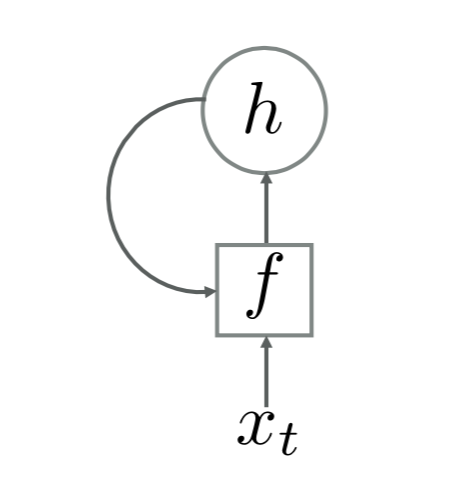

This article contains digests from:

- [《神经网络与深度学习》](https://nndl.github.io/)
- [The Unreasonable Effectiveness of Recurrent Neural Networks](http://karpathy.github.io/2015/05/21/rnn-effectiveness/)

### 1 What is RNN?

Recurrent Neural Network is a class of neural networks with self-feedback neurons that are capable of handling sequences of variable-length. The figure below shows a typical RNN architecture.

Given a sequence of inputs \(\mathbf{x}_{1:T}=(\mathbf{x}_1, \mathbf{x}_2,\cdots,\mathbf{x}_T)\), the activation \(\mathbf{h}_t\) (namely, the hidden state at time \(t\)) is given by
$$
\mathbf{h}_t = f(\mathbf{h}_{t-1}, \mathbf{x}_t)
$$
where \(\mathbf{h}_0=\mathbf{0}\) and \(f(\cdot)\) is a non-linearity (a non-linear function of a feed-forward net).

### 2 Variations of RNN

#### 2.1 Vanilla RNN / Simple Recurrent Network (SRN)
In a Simple Recurrent Network, \(\mathbf{h}_t\) is updated by
$$
\mathbf{h}_t = f(U\mathbf{h}_{t-1} + W\mathbf{x}_t + \mathbf{b})
$$
where \(U\) is a *state-state* weight matrix,  \(W\) is a *state-input* weight matrix, and \(\mathbf{b}\) is a bias vector.

Theoretically, this model is capable of modeling any non-linear dynamical system. However, it suffers from the problems of ***gradient vanishing*** and ***gradient exploding*** (For details of how, refer to section 6.5 of  [this book](https://nndl.github.io/) ) and thus can't really model dependency over a long range of a sequence, which is often called ***Long-Term Dependencies Problem***.

#### 2.2 Long Short-Term Memory (LSTM)

Several solutions can be applied to avoid the problem above. To avoid gradient from exploding, we can use <u>weight decay</u> or <u>gradient clipping</u>. To avoid gradient from vanishing, apart from applying certain optimization techniques, we can modify the model further. A simple thought is to apply a mechanism very similar to Residual Networks,
$$
\mathbf{h}_t = \mathbf{h}_{t-1} + g(\mathbf{x}_t, \mathbf{h}_{t-1};\theta)
$$
where \(g(\cdot)\) is a non-linearity (for details, again, refer to section 6.5 of  [this book](https://nndl.github.io/) ).

Such a model still suffers from the gradient vanishing problem and the memory capacity problem, i.e., to some point \(\mathbf{h}_t\) can no longer store much informations.

Gated RNNs are an elegant modification of vanilla RNNs. One such example is LSTM, in which \(\mathbf{h}_t\) is updated by
$$
\begin{equation}\begin{split} 
\mathbf{c}_t &= \mathbf{f}_t\odot \mathbf{c}_{t-1} + \mathbf{i}_t\odot \tilde{\mathbf{c}}_t\\
\mathbf{h}_t &= \mathbf{o}_t\odot\tanh(\mathbf{c}_t)
\end{split}\end{equation}
$$
where \(\mathbf{c}_t\) is the *internal state* for linear information passing (\(\mathbf{c}\) is short for *memory cell*), \({f}_t\), \(\mathbf{i}_t\) and \(\mathbf{o}_t\) are three gates used to control the flow of information, \(\odot\) is element-wise production, \(\tilde{\mathbf{c}}_t\) is the *candidate state*, which is given by
$$
\tilde{\mathbf{c}}_t = \tanh(U_c\mathbf{h}_{t-1} + W_c\mathbf{x}_t + \mathbf{b}_c)
$$

The three gates are used in the following manner:

- ***forget*** gate \(\mathbf{f}_t\) controls how much information should be discarded from the previous internal state \(\mathbf{c}_{t-1}\)
- ***input*** gate \(\mathbf{i}_t\) controls how much information should be stored from the candidate state \(\tilde{\mathbf{c}}_t\)
- ***output*** gate \(\mathbf{o}_t\) controls how much information should be transferred from the internal state \(\mathbf{c}_{t}\) to external state \(\mathbf{h}_{t}\)

The values of the three gates are given by
$$
\begin{equation}\begin{split} 
\mathbf{f}_t &= \sigma(U_f\mathbf{h}_{t-1} + W_f\mathbf{x}_t + \mathbf{b}_f)\\
\mathbf{i}_t &= \sigma(U_i\mathbf{h}_{t-1} + W_i\mathbf{x}_t + \mathbf{b}_i)\\
\mathbf{o}_t &= \sigma(U_o\mathbf{h}_{t-1} + W_o\mathbf{x}_t + \mathbf{b}_o)
\end{split}\end{equation}
$$
where \(\sigma(\cdot)\) is a Logistic function.

P.S.

In RNNs, \(\mathbf{h}\) stores information about history inputs. In SRNs, \(\mathbf{h}\) is rewritten at every time step \(t\), thus can be perceived as a short-term memory. On the other hand, in LSTM, the *memory cell* \(\mathbf{c}\) stores history information for some time steps (controlled by forget gate), thus can be seen as a short-term memory that lasts longer than \(\mathbf{h}\). This is how the name "Long Short-term Memory" comes about.

#### 2.3 Gated Recurrent Unit (GRU)

Gated Recurrent Unit is another RNN that uses gating mechanism. However, it does not introduce an extra memory cell. In GRU, \(\mathbf{h}_t\) is updated by
$$
\mathbf{h}_t = \mathbf{z}_t\odot\mathbf{h}_{t-1} + (1-\mathbf{z}_t)\odot \tilde{\mathbf{h}}_t
$$
where \(\mathbf{z}_t\in [0,1]\), called ***update*** gate, is computed by
$$
\mathbf{z}_t = \sigma(U_z\mathbf{h}_{t-1} + W_z\mathbf{x}_t + \mathbf{b}_z)
$$
and, \(\tilde{\mathbf{h}}_t\) is computed by
$$
\begin{equation}\begin{split}
\tilde{\mathbf{h}}_t &= \tanh(U_h(\mathbf{r}_t\odot\mathbf{h}_{t-1}) + W_h\mathbf{x}_t + \mathbf{b}_h)\\
\mathbf{r}_t &= \sigma(U_r\mathbf{h}_{t-1} + W_r\mathbf{x}_t + \mathbf{b}_r)
\end{split}\end{equation}
$$
where \(\mathbf{r}_t\in [0,1]\), called ***reset*** gate, controls how much the candidate state \(\tilde{\mathbf{h}}_t\) depends on the previous state \(\mathbf{h}_{t-1}\).

Intuitively, the GRU uses only one gate, as opposed to two in LSTM, to control the balance between the operations of *forget* and *input*, making it a simpler network than LSTM.

### 3 What can RNNs do?
What exactly is a recurrent network capable of?

#### 3.1 It can handle sequences.
A glaring limitation of **Vanilla** Neural Networks (and also Convolutional Networks) is that their API is too constrained: they accept a fixed-sized vector as input (e.g. an image) and produce a fixed-sized vector as output (e.g. probabilities of different classes). 

> P.S. Vanilla means *"ordinary"* or *"plain"*, not a flavor of dessert. Here it means ordinary neural nets like BPNN, MLP; likewise, vanilla RNNs means ordinary RNNs.

The above picture shows some situations for a deep learning system to model. The leftmost subfigure illustrates the situation where both the input and the output are fixed-sized. This can be done without RNNs.
The other subfigures show some more common situations, where a system has: <u>sequence output</u> (image captioning), <u>sequence input</u> (text sentiment classification), <u>asynced sequence input and output</u> (machine translation), and 
<u>synced sequence input and output</u> (POS tagging and NER).

RNNs combine the input vector with their state vector with a fixed (but learned) function to produce a new state vector. This can in programming terms be interpreted as running a fixed program with certain inputs and some internal variables. Viewed this way, **<u>RNNs essentially describe programs</u>**. 
**<u>RNNs are Turing-Complete in the sense that they can to simulate arbitrary programs (with proper weights)</u>**. 

**P.S.**

In [Siegelmann and Sontag, 1991](http://citeseerx.ist.psu.edu/viewdoc/summary?doi=10.1.1.47.8383), the authors models a recursive net with continuous-valued neurons as a dynamical system and remark that 
not only can one simulate a processor net with a Turing machine but any function computable by a Turing machine can be computed by a processor net. The paper shows a universal Turing machine can be simulated 
by a finite neural network made up of sigmoidal neurons.

> If training vanilla neural nets is optimization over functions, training recurrent nets is optimization over programs.

#### 3.2 It excels at handling non-sequential data
Even if the inputs/outputs are fixed vectors, it is still possible to use this powerful formalism to process them in a sequential manner.
The following picture illustrates a recurrent network that generates images of digits by learning to sequentially add color to a canvas ([Gregor et al.](https://arxiv.org/abs/1502.04623))

In doing this, you’re <u>learning stateful programs that process your fixed-sized data</u>, as opposed to merely learning a mapping between the input and the output.

### 4 Conclusion
RNNs are powerful. For further study, please refer to the materials listed at the top of this page.